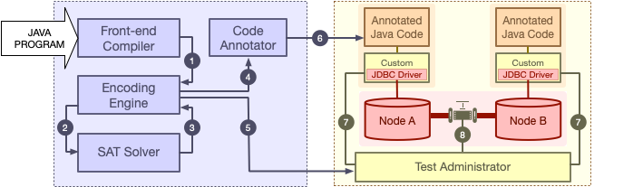

### CLOTHO:  Directed Test Generation for Weakly Consistent Database Systems
CLOTHO is a testing framework for detecting serializability
violations in (SQL) database-backed Java applications executing on weakly-consistent storage systems. It 
combines a static analyzer and model checker to generate abstract executions, discover 
serializability violations in these executions, and translate them back into concrete test inputs suitable 
for deployment in a test environment.
CLOTHO currently supports [Apache Cassandra](http://cassandra.apache.org/) as
its database module. We are planning to add support for other databases in the
future. 



---

### Dependencies 
- [Java 1.8.0](https://java.com/en/download/help/index_installing.xml)
- [Z3 Theorem Prover](https://github.com/Z3Prover/z3)
- [Docker](https://www.docker.com/)


 
---

### Setup
Create a local repo of the project:
``` sh
git clone https://github.com/Kiarahmani/CLOTHO.git
```
Make sure docker daemon is running and current user is added to docker group and has privileges ([read more](https://docs.docker.com/install/linux/linux-postinstall/)). 

Move to the project directory and run the following command to create a cluster
of 2 Cassandra nodes each running in a docker container: 
``` sh
./clotho.sh --setup 2
```
You can verify that the cluster is correctly set up by running: 
```sh 
./clotho.sh --cluster
```
You should see something like: 
```
Datacenter: DC1
===============
Status=Up/Down
|/ State=Normal/Leaving/Joining/Moving
--  Address     Load       Tokens       Owns (effective)  Host ID                               Rack
UN  172.17.0.2  325.94 KiB  256          100.0%            2b1a9362-9071-4976-8434-315667548f3e  RAC1
Datacenter: DC2
===============
Status=Up/Down
|/ State=Normal/Leaving/Joining/Moving
--  Address     Load       Tokens       Owns (effective)  Host ID                               Rack
UN  172.17.0.3  309.56 KiB  256          100.0%            d3780a0e-7ebc-4d8a-a7e8-60ba9a74bdf9  RAC2
```


### Static Analysis 
Now that the cluster is up and running, you should choose a <benchmark_name> from pre-defined examples {dirty_read, dirty_write, long_fork, write_skew, lost_update} (or as we explain later, implement your own in analyzer/src/benchmarks/).

The following command will compile the source codes, including the chosen benchmark under test:
``` sh
make benchmark=<benchmark_name>
```
Now you can run CLOTHO's static analyzer by the following command (you can optionlly configure the analysis by editing `templates/config.properties`).
``` sh
./clotho.sh --analyze <benchmark_name>
```
Once the analysis finishes, CLOTHO will report the number of static anomalies found in <benchmark_name>, for example:
```
     [java] ================================
     [java] === AR compile time:  256ms
     [java] === Anomalies found:  1
     [java] === Analysis time:	  1753 ms
     [java] === Avg Ext. Time:	  1753 ms
```

Now you can view anomaly <anomaly_number> by running: 
```sh
./clotho.sh --show <benchmark_name> <anomaly_number>
```
For example:


### Replaying Anomalies
Following command will create required keyspace and schema for an anomaly on the Cassandra cluster:
```sh
./clotho.sh --init <benchmark_name> <anomaly_number>
```
Now open separate terminals: one for the test controller and one for each transaction (a.k.a client) involned in the anomaly.

Run  the following command in the controller terminal:
```sh
./clotho.sh -d <benchmark_name> <anomaly_number>
```

Finally, run the following command in each client terminal:
```sh
./clotho.sh --client <benchmark_name> <anomaly_number> <client_number>
```
You should see each client running according to the buggy schedule determined in the static analysis step. 
Have fun!


---
## Publications
- CLOTHO: Directed Test Generation for Weakly Consistent Database Systems (Conditionally Accepted to [OOPSLA'19](https://conf.researchr.org/track/splash-2019/splash-2019-oopsla#event-overview))


